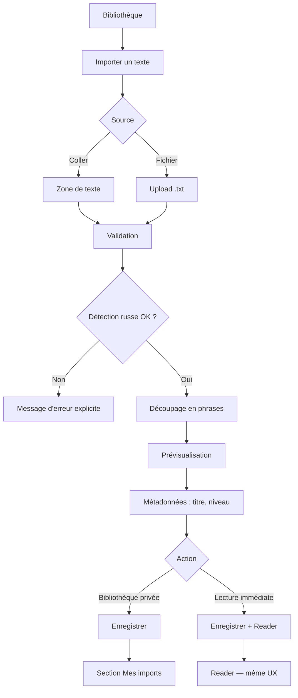

# Import de textes — Conception V1

> **Story 4.1** — Conception (pas d'implémentation)  
> Dernière mise à jour : juillet 2026

Ce document définit **comment fonctionne l'import** du point de vue utilisateur et produit, avant toute ligne de code.

**Alignement méthode** : [METHODE_ROSSIYANI.md](../METHODE_ROSSIYANI.md) §5 — l'import alimente **Library → Lire** sans court-circuiter la boucle.

**État technique actuel** : le schéma `texts` prévoit déjà `source` (`curated` | `imported`) et `imported_by` — mais RLS, UI et API sont absents ([PROJECT_STATE.md](../PROJECT_STATE.md)).

---

## 1. Vision produit

### Pourquoi l'import maintenant

Rossiyani dispose d'une **boucle pédagogique réelle** (Reader → Explorer → Lessons → retour Reader). L'import est la première fonctionnalité qui transforme la démo en **outil quotidien** : l'utilisateur lit *ses* textes — cours, manuel, article — avec la même méthode.

### Promesse utilisateur

> Colle un texte russe. Lis-le comme dans Rossiyani. Explore les mots. Retiens ce qui compte.

### Ce que l'import n'est pas (V1)

- Pas un convertisseur PDF / EPUB
- Pas un traducteur automatique obligatoire
- Pas un éditeur de leçons
- Pas un partage social de textes

---

## 2. Formats supportés V1

| Format | V1 | Priorité | Notes |
|--------|-----|----------|-------|
| **Copier / Coller** | ✅ | **P0** | Cas principal — extrait de PDF, site, manuel, email |
| **Fichier `.txt`** | ✅ | P1 | UTF-8, un fichier = un texte |
| **PDF** | ❌ | V2 | Extraction OCR / layout complexe |
| **EPUB** | ❌ | V2 | Structure chapitres, métadonnées |
| **URL** | ❌ | V2 | Scraping, droits, instabilité |

Le copier/coller couvre déjà la majorité des usages réels (sélection dans un PDF ouvert, page web, document Word exporté en texte).

### Encodage

- **UTF-8** obligatoire pour `.txt`
- Normalisation **NFC** côté serveur (aligné sur le Reader existant)

---

## 3. Flux utilisateur V1

### 3.1 Vue d'ensemble



### 3.2 Point d'entrée

**Bibliothèque** (`/library`) — remplacer la carte fantôme « Suggérer un texte » par :

> **Importer un texte**  
> Collez un extrait russe ou importez un fichier .txt

Route dédiée : `/import` + `/import/preview` — voir [UX_V1.md](./UX_V1.md).

### 3.3 Étape par étape

| Étape | Ce que voit l'utilisateur | Système (futur) |
|-------|---------------------------|-----------------|
| 1. Source | Onglets *Coller* / *Fichier .txt* | — |
| 2. Contenu | Textarea ou dropzone | Limite taille, encodage |
| 3. Validation | Spinner court « Analyse… » | Détection cyrillique, longueur min/max |
| 4. Prévisualisation | Phrases découpées, compteurs (mots, phrases, ~min lecture) | `splitIntoSentences`, `word_count` |
| 5. Métadonnées | Titre (obligatoire), niveau estimé (A1–B2, modifiable) | Pas d'IA niveau en V1 — choix utilisateur |
| 6. Confirmation | Deux actions équivalentes en importance | Insert `texts` |
| 7a. Bibliothèque | Toast « Texte enregistré » → section *Mes imports* | `source=imported`, `imported_by` |
| 7b. Lecture | Redirection `/reader/[id]` | Même Reader |

### 3.4 Prévisualisation (écran clé)

L'utilisateur voit :

- **Titre** — pré-rempli depuis la première ligne si courte (< 80 car.), sinon « Mon texte »
- **Aperçu** — 3–5 premières phrases + « … et N autres phrases »
- **Stats** — X phrases · Y mots · ~Z min de lecture
- **Niveau** — sélecteur A1 / A2 / B1 / B2 (défaut : niveau cible du profil utilisateur)

Pas de traduction française en prévisualisation V1.

### 3.5 Bibliothèque après import

Deux zones distinctes dans `/library` :

| Zone | Contenu | Visibilité |
|------|---------|------------|
| **Collections Rossiyani** | Textes gold + seed (`source=curated`) | Tous les utilisateurs |
| **Mes imports** | Textes personnels (`source=imported`) | Propriétaire uniquement |

Les imports n'apparaissent pas dans les collections thématiques officielles.

---

## 4. Règles produit (non négociables)

### 4.1 Confidentialité

- Un texte importé n'est visible **que par son propriétaire** (`imported_by = auth.uid()`)
- Aucun partage, aucune indexation publique, aucune suggestion communautaire en V1
- Suppression = droit de l'utilisateur sur ses imports (Story technique dédiée)

### 4.2 Même pipeline Reader

Le texte importé passe par le **même modèle** que les textes officiels :

| Champ | Texte curated | Texte importé V1 |
|-------|---------------|------------------|
| `content` | Texte russe complet | Identique |
| `content_annotated.sentences[].text` | Phrases | Identique (découpage auto) |
| `content_annotated.sentences[].translationFr` | Présent | **Absent en V1** — voir §4.4 |
| `content_annotated.sentences[].words` | Pré-annoté (seed) | Absent — Explorer à la demande |
| `level` | Éditorial | Choix utilisateur |
| `collection` | `everyday_russian`, etc. | `imported` (slug fixe) |
| `source` | `curated` | `imported` |
| `imported_by` | `NULL` | `user_id` |

### 4.3 Même UX Reader

- Clic mot → **Explorer** (explication contextuelle, cache `explanation_cache`)
- Sauvegarde → **Vocabulary** + SRS
- Progression → `user_progress`
- Accents toniques : **non garantis** en V1 import — l'Explorer et l'affichage fonctionnent sans

### 4.4 Traduction phrase par phrase — dette assumée V1

Les textes officiels ont `translationFr` pour l'étape **Comprendre** de la méthode.

**V1 import** : russe seul, pas de bouton « voir la traduction » (comportement Reader existant si `translationFr` absent).

**V1.1+ (story future)** : traduction phrase par phrase à l'import ou à la demande — **hors scope 4.1**, pas bloquant pour lancer l'import.

> L'import V1 mise sur **Explorer** comme principal levier de compréhension — cohérent avec la philosophie « pourquoi cette forme ici », mais l'étape Comprendre globale est allégée jusqu'à la story traduction.

### 4.5 Liens Lessons

Les cartes Reader ↔ Lessons (Story 3.4) s'appliquent aux textes **curated** avec `related_texts`. Les imports n'ont pas de leçons liées en V1 — pas de régression.

### 4.6 Test méthode Rossiyani

| Question | Réponse import V1 |
|----------|-------------------|
| À quelle étape de la boucle ? | **Lire** (via Library) |
| Quelle question unique ? | « Comment lire *mon* texte avec la méthode ? » |
| Respecte les 8 principes ? | Oui — contexte réel, Explorer, pas de quiz hors phrase |

---

## 5. Limites V1

### 5.1 Par texte

| Limite | Valeur | Raison |
|--------|--------|--------|
| Longueur max | **15 000 mots** | ~ chapitre / article long ; coût Explorer raisonnable |
| Longueur min | **30 mots** | Éviter fragments vides |
| Phrases max | **500** | Performance Reader + preview |
| Taille fichier `.txt` | **500 Ko** | Upload raisonnable |

### 5.2 Par utilisateur

| Limite | Valeur | Raison |
|--------|--------|--------|
| Textes importés max | **20** | Beta — éviter abus stockage |
| Imports / jour | **5** | Anti-spam léger |

### 5.3 Contenu accepté

| Règle | Détail |
|-------|--------|
| Langue | ≥ **70 %** de caractères cyrilliques (hors ponctuation/chiffres) |
| Contenu rejeté | Texte vide, latin seul, HTML brut non nettoyé (strip basique V1) |
| Nettoyage V1 | Trim, normalisation NFC, collapse espaces multiples, suppression lignes vides excessives |

### 5.4 Ce qui n'est pas limité en V1

- Nombre de mots explorés par session
- Sauvegardes vocabulaire depuis un import
- Relectures illimitées

---

## 6. Détection et découpage (spécification fonctionnelle)

### 6.1 Détection du russe

```
ratio = caractères_cyrilliques / caractères_alphabétiques
accepté si ratio ≥ 0.70
```

Message utilisateur si rejet : *« Ce texte ne semble pas être en russe. Rossiyani importe uniquement des textes en cyrillique. »*

### 6.2 Découpage en phrases

Réutiliser la logique existante `splitIntoSentences` :

```
split sur (?<=[.!?…])\s+
trim + filtrer vides
```

Cas limites documentés :

- Dialogues avec `—` : une ligne = une phrase si pas de `.!?` — acceptable V1
- Abréviations russes : faux positifs rares — acceptable V1
- Texte sans ponctuation finale : une seule phrase

### 6.3 Métadonnées auto

| Champ | Calcul |
|-------|--------|
| `word_count` | Mots cyrilliques + mots mixtes, split espaces |
| `reading_time_minutes` | `word_count / 20` (même ratio A1 que charte Reader) |
| `title` | Saisie utilisateur obligatoire avant save ; suggestion auto optionnelle |

---

## 7. Modèle de données (existant + évolutions prévues)

### 7.1 Déjà en place (`001_initial_schema.sql`)

```sql
source TEXT DEFAULT 'curated',  -- 'curated' | 'imported'
imported_by UUID REFERENCES auth.users(id),
```

### 7.2 Évolutions requises (stories techniques)

| Évolution | Story |
|-----------|-------|
| RLS : `curated` lisible par tous ; `imported` par propriétaire seul | 4.2 |
| Index `(imported_by, created_at)` | 4.2 |
| Collection slug `imported` dans `collections.ts` | 4.5 |
| Contrainte CHECK `source` + `imported_by` cohérents | 4.2 |

### 7.3 Structure `content_annotated` minimale à l'import

```json
{
  "sentences": [
    { "text": "Первое предложение." },
    { "text": "Второе предложение." }
  ]
}
```

`translationFr` et `words` absents — le Reader les gère déjà comme optionnels.

---

## 8. Maquettes textuelles (wireframes)

### Écran Import — Coller

```
┌─────────────────────────────────────────────┐
│  ← Bibliothèque                             │
│                                             │
│  IMPORTER UN TEXTE                          │
│  Lis ton propre russe avec la méthode       │
│  Rossiyani.                                 │
│                                             │
│  [ Coller ]  [ Fichier .txt ]               │
│                                             │
│  ┌─────────────────────────────────────┐   │
│  │ Collez votre texte russe ici…       │   │
│  │                                     │   │
│  └─────────────────────────────────────┘   │
│                                             │
│  12 450 / 15 000 mots                       │
│                                             │
│              [ Analyser → ]                 │
└─────────────────────────────────────────────┘
```

### Écran Prévisualisation

```
┌─────────────────────────────────────────────┐
│  PRÉVISUALISATION                           │
│                                             │
│  Titre : [ Мой текст________________ ]      │
│  Niveau : (A1) A2  B1  B2                   │
│                                             │
│  42 phrases · 890 mots · ~45 min              │
│                                             │
│  ─ Первое предложение.                      │
│  ─ Второе предложение.                      │
│  ─ Третье предложение.                      │
│    … et 39 autres phrases                   │
│                                             │
│  ℹ️ Les traductions phrase par phrase       │
│     ne sont pas incluses à l'import.        │
│     Explore chaque mot pour comprendre.     │
│                                             │
│  [ Enregistrer ]    [ Lire maintenant → ]   │
└─────────────────────────────────────────────┘
```

### Bibliothèque — Mes imports

```
┌─────────────────────────────────────────────┐
│  MES IMPORTS                    3 textes    │
│                                             │
│  ┌──────────┐ ┌──────────┐ ┌──────────┐  │
│  │ Мой текст│ │ Глава 2  │ │ +Importer│  │
│  │ A2 · 45% │ │ A1 · 0%  │ │          │  │
│  └──────────┘ └──────────┘ └──────────┘  │
└─────────────────────────────────────────────┘
```

---

## 9. Découpage en stories techniques BMAD

Les stories ci-dessous sont **indépendantes** et implémentables dans l'ordre indiqué.

| Story | Titre | Livrable | Dépendances |
|-------|-------|----------|-------------|
| **4.2** | RLS & schéma import | Migration : policies `texts`, index, contraintes `source` / `imported_by` | — |
| **4.3** | Pipeline d'analyse | Lib `analyze-import.ts` : cyrillique, split, stats, nettoyage, limites | — |
| **4.4** | API import | `POST /api/import/preview` + `POST /api/import` | 4.2, 4.3 |
| **4.5** | UI Import | Page `/import` : coller, .txt, preview, save / read now | 4.4 |
| **4.6** | Library — Mes imports | Section dédiée, filtre, carte « Importer », masquer curated dans cette section | 4.2, 4.4 |
| **4.7** | Reader — polish import | Badge « Importé », message doux si pas de traduction, gestion suppression | 4.4 |

### Stories reportées (post-V1 import)

| Story | Titre | Notes |
|-------|-------|-------|
| **4.8** | Traduction phrase à l'import | IA — restaure l'étape Comprendre |
| **4.9** | Accents toniques auto | Amélioration affichage |
| **4.10** | Import PDF | V2 |
| **4.11** | Import URL | V2 |
| **4.12** | Édition / re-import | Modifier un texte importé |

### Ordre de développement recommandé

```
4.2 → 4.3 → 4.4 → 4.5 → 4.6 → 4.7
```

Parallélisable : 4.3 (lib) en parallèle de 4.2 (migration).

---

## 10. Critères d'acceptation Story 4.1 (cette story)

- [x] Formats V1 validés (coller + .txt ; PDF/EPUB/URL en V2)
- [x] Flux utilisateur documenté de bout en bout
- [x] Règles confidentialité + pipeline Reader définies
- [x] Limites V1 chiffrées
- [x] Stories techniques 4.2–4.7 découpées
- [x] Dettes V1 explicites (traductions, accents, lessons)
- [x] Alignement METHODE_ROSSIYANI vérifié

**Épic Import V1 ✅** — Stories 4.2–4.6 terminées  
**Prochaine** : 4.7 polish Reader (optionnel) → **Phase C** branding + polish UI

---

## Références

| Document | Lien |
|----------|------|
| Méthode | [METHODE_ROSSIYANI.md](../METHODE_ROSSIYANI.md) |
| Schéma DB | [architecture.md](../architecture.md), migration `001` |
| Reader split | `src/lib/utils/russian.ts` → `splitIntoSentences` |
| État produit | [PROJECT_STATE.md](../PROJECT_STATE.md) |
| Stories techniques | [STORIES.md](./STORIES.md) |
| UX maquettes | [UX_V1.md](./UX_V1.md) |
